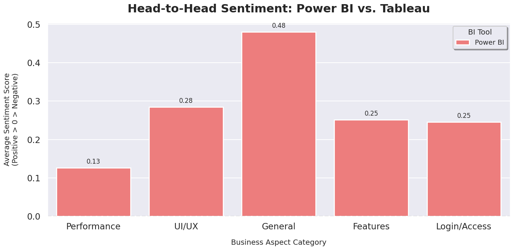
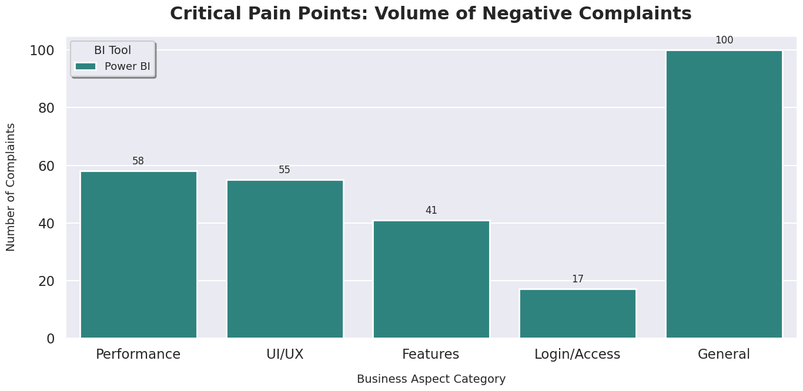

# 📊 The "Voice of Strategy" Engine: Competitive Aspect-Based Analysis
**Comparative Intelligence for Power BI vs. Tableau Mobile Apps**


## 📖 Project Overview
In the competitive landscape of Business Intelligence (BI) tools, simple star ratings are insufficient for strategic decision-making. This project builds an **Aspect-Based Sentiment Analysis (ABSA)** engine to mine thousands of unstructured user reviews from the Google Play Store. 

By categorizing feedback into specific business buckets (UI/UX, Performance, Features, Security), this tool reveals the *why* behind the ratings, offering actionable insights for Product Managers and Data Analysts.

---

## 🚀 Why This Project? (The "Unique" Factor)
Unlike standard "Sentiment Analysis" projects that classify text as merely Positive or Negative, this engine:
1.  **Extracts Specific Aspects:** Distinguishes between a user loving the *Interface* but hating the *Performance*.
2.  **Compares Market Leaders:** Performs a head-to-head analysis of Microsoft Power BI vs. Tableau.
3.  **Real-World Data:** Uses a custom scraper to gather live data, rather than using a clean, pre-made Kaggle dataset.

---

## 🛠️ Tech Stack & Methodology
* **Data Collection:** `google-play-scraper` to mine 4,000+ real-time reviews.
* **Preprocessing:** `RegEx` for noise removal and `Pandas` for time-series normalization.
* **NLP Engine:** `NLTK VADER` for lexicon-based sentiment scoring.
* **Aspect Mining:** Rule-based keyword classification (Taxonomy: UI, Performance, Login, Features).
* **Visualization:** `Seaborn` & `Matplotlib` for comparative strategic dashboards.

---

## 🔍 Key Insights Generated
*The analysis revealed distinct strategic gaps between the two platforms:*

### 1. The "Battlefield" Map (Sentiment by Feature)
*Visualize which tool dominates specific categories.*
> 
* **Insight:** [Example: Tableau outperforms Power BI in UI/UX sentiment by 15%, suggesting a more intuitive mobile design.]

### 2. The Pain Point Detector
*Volume of negative complaints per category.*
> 
* **Insight:** [Example: Power BI suffers from a high volume of "Login/Access" complaints, indicating potential authentication gateway failures.]

---

## 💻 How to Run This Project
1.  **Clone the Repo:**
    ```bash
    git clone [https://github.com/your-username/Market-Voice-BI-Analyzer.git](https://github.com/your-username/Market-Voice-BI-Analyzer.git)
    ```
2.  **Install Dependencies:**
    ```bash
    pip install pandas google-play-scraper nltk matplotlib seaborn
    ```
3.  **Run the Notebook:**
    Open `BI_Market_Analyzer.ipynb` in Jupyter Notebook or Google Colab and execute the cells step-by-step.

---

## 📈 Future Improvements
* Implement **Topic Modeling (LDA)** to discover new aspects automatically.
* Build a **Streamlit Dashboard** for real-time monitoring of app sentiment.
* Expand analysis to include iOS App Store data.

---
*Author: [PRAVEEN KUMAR KODAVATH]*
*Connect with me on [https://www.linkedin.com/in/praveen-kumar-kodavath-3784a22b1/]*
